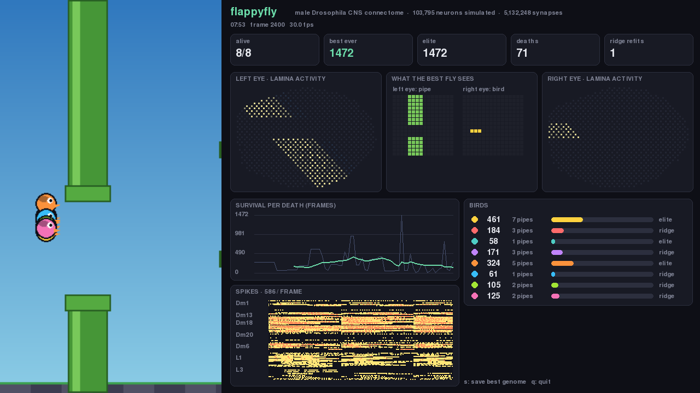
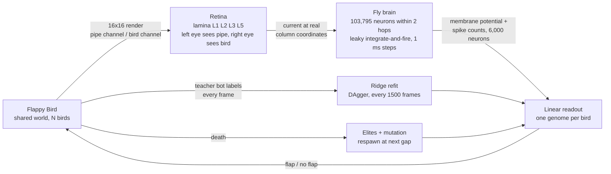
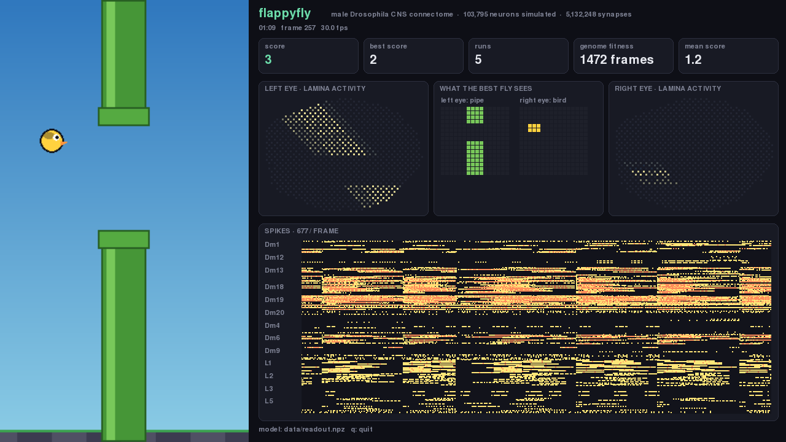

<h1 align="center">flappyfly</h1>

<p align="center">
The complete male <i>Drosophila</i> connectome, simulated as a spiking network, evolving to play Flappy Bird.
</p>

<p align="center">
<a href="https://male-cns.janelia.org"></a>


</p>

<p align="center">

</p>

## What this is

In 2026 Janelia FlyEM and Google Research released the first complete wiring diagram of an adult male fruit fly's central nervous system: every neuron, every synapse, brain and nerve cord. **flappyfly** loads that wiring diagram, runs it as a network of leaky integrate-and-fire neurons, shows it a game of Flappy Bird through its own eyes and lets a population of flies learn to play.

The brain is never trained. Not one synapse is changed. The only thing that learns is a single linear readout on top of the brain's activity: a few thousand weights fit by ridge regression and refined by evolution. This is reservoir computing with a real nervous system as the reservoir.

## How it works



1. **Data.** The flat-connectome tables (neuron annotations, per-neuron neurotransmitter predictions, segment-to-segment weights) are downloaded from the public bucket and turned into a signed sparse matrix. GABA, glutamate and histamine are inhibitory, everything else excitatory, 0.275 mV per synapse.
2. **Simulation.** Leaky integrate-and-fire with the constants from Shiu et al. 2024 (tau 20 ms, threshold 7 mV, 2.2 ms refractory, alpha synapses, 1.8 ms delay). Only the out-edges of neurons that actually spiked are touched each step. The brain is pruned to the neurons within two synapses of the lamina, which is exact at the gain used: nothing further away ever fires.
3. **Vision.** The game is rasterised to two 16x16 channels. Each lamina neuron has an optic-lobe column coordinate in the annotations, so a pixel maps to the neurons of that column. The left eye is shown the next pipe, the right eye is shown the bird.
4. **Readout.** Membrane potential and spike count of the 6,000 most visually responsive neurons, standardised, times a weight vector. Positive means flap.
5. **Learning.** Eight birds share one world; each has its own copy of the brain in its own process and its own readout genome. A scripted teacher bot labels every frame every bird sees; every 1500 frames a background thread refits the ridge readout on that experience (DAgger). When a bird dies it respawns at the next gap with either a mutated elite or the latest ridge fit. Whichever survives longer wins.

Survival goes from a handful of frames to over a thousand within about ten minutes on eight CPU cores.

## Install and run

Requires Python 3.14 and [uv](https://docs.astral.sh/uv/).

```bash
git clone https://github.com/Nuu-maan/flappyfly
cd flappyfly
uv sync
uv run flappyfly build      # downloads ~1.2 GB of connectome tables once, caches data/brain.npz
uv run flappyfly play       # the evolution window
uv run flappyfly showcase   # one fly on the best genome trained so far
uv run flappyfly train      # headless imitation fit with a random-reservoir control
```

### The evolution window

`flappyfly play` opens the dashboard shown above. Left: the game, one colour per fly, a ring where a fly died. Right: alive count, best survival, deaths, ridge refits; the best living fly's lamina activity drawn at real column positions for both eyes; what it sees; the survival curve with a rolling mean; the roster with each genome's origin; and a spike raster grouped by cell type. The best genome is saved to `data/readout.npz` whenever a new record is set. `s` saves, `q` quits.

### The showcase

<p align="center">

</p>

`flappyfly showcase` runs a single fly on the best saved genome and restarts it whenever it dies, keeping score across runs. The saved model carries its fitness, so a later training session never overwrites a fitter genome with a worse one.

## Project layout

```
src/flappyfly/
  data.py       download the flat-connectome feathers, build the signed sparse matrix
  brain.py      Brain dataclass, neuron lookup, k-hop reachability, subgraph
  sim.py        LIF simulator, presynaptic-indexed updates, gain knob
  vision.py     image channels to currents on retinotopically mapped lamina neurons
  game.py       headless Flappy Bird, shared world, many birds, teacher bot
  readout.py    ridge regression readout on membrane potential and spike counts
  train.py      feature selection, imitation data collection, evaluation, random control
  evolve.py     population: one brain process per bird, elites, mutation, DAgger refits
  gui.py        pygame dashboard
  showcase.py   single fly on the best saved genome
  cli.py        entry point
tests/          game rules, population API, sim silence and response, pruning, readout
```

## Caveats

- Synaptic gain is 0.8x the literature value. At 1.0 the visual drive tips mushroom-body and optic-lobe feedback loops into self-sustained firing ([#2](https://github.com/Nuu-maan/flappyfly/issues/2)). At 0.8 activity stays in the optic lobe, so this is a fly's visual system playing, not its whole brain.
- Column coordinates are binned straight onto a square grid, so the image the fly sees is skewed ([#3](https://github.com/Nuu-maan/flappyfly/issues/3)).
- Only the next pipe is drawn: a linear readout cannot gate between two visible gaps.
- Edges with fewer than 3 synapses are dropped.

## Data and credits

- Connectome: [Male CNS Connectome v1.0](https://male-cns.janelia.org), HHMI Janelia FlyEM and Google Research, CC-BY 4.0.
- Neurotransmitter predictions: Eckstein, Bates et al. 2024.
- Simulation constants: Shiu et al. 2024, "A Drosophila computational brain model reveals sensorimotor processing".
